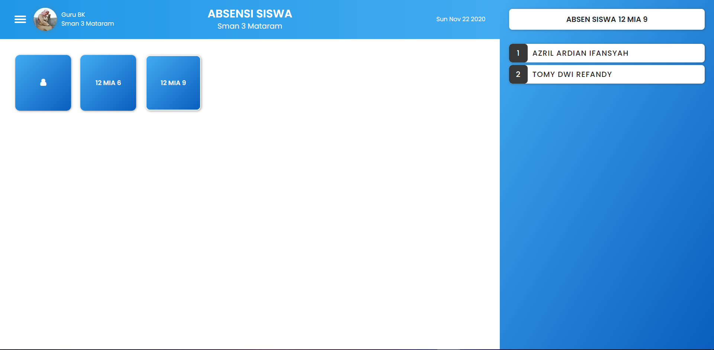
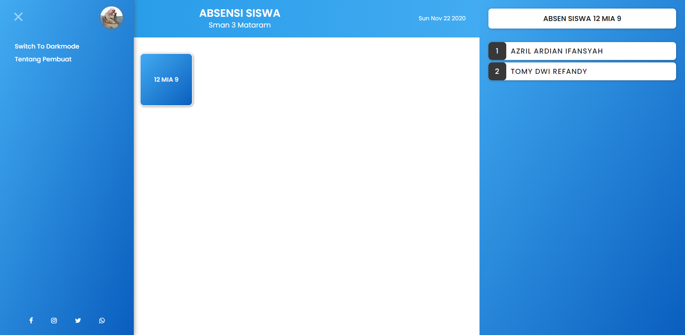
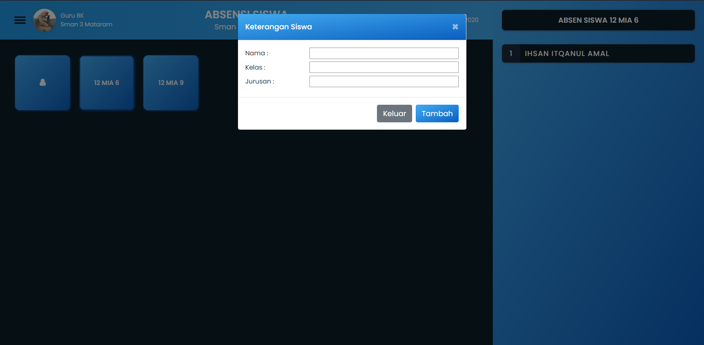

# Program Absensi Siswa

## Apa dan Tujuan

_Project_ ini sebenarnya merupakan _project_ yang sudah lama ingin saya buat, namun, saat itu saya merasa sangat susah untuk merealisasikannya, karena ketika itu pengetahuan saya dalam dunia _programming_ terbilang masih terlalu minim, alhasil, _project_ ini saya tinggalkan lalu terbengkalai begitu saja.

Ketika saya merasa ilmu yang saya miliki sudah cukup baik, terutama pada dasar - dasar bahasa Javascript, saya berkeinginan untuk menyelesaikan _project_ ini. Semua saya bangun kembali dari awal, mulai dari membuat tampilan program, merancang alur program, hingga membangunnya.

Ini merupakan program absen siswa yang dapat memudahkan guru untuk melakukan absensi, karena kemudahannya yang dapat diakses melalui komputer / ponsel mereka. Bisa dibilang, ini adalah absensi siswa kekinian yang sangat bermanfaat, karena sekolah tidak perlu lagi mencetak lembaran absensi siswa setiap minggunya, atau bahkan bulan, cukup hanya memesan guru untuk membawa laptop pribadi / ponsel mereka pada saat pelajaran berlangsung.

## Teknologi yang digunakan

-   Html
-   Css
-   Bootstrap
-   Javascript
-   Sweetalert2
-   Webpack

## Fitur

-   _Login_ ( belum menggunakan _database_ )
-   Kehadiran siswa ( bolos, izin, sakit )
-   Hapus siswa, mengubah nama siswa
-   Otomatis mengelompokan siswa berdasarkan kelas
-   _Darkmode_
-   Responsif pada semua ukuran _device_
-   Menyimpan data ke _local storage_

## Catatan

_Project_ ini merupakan versi **2.0**, silahkan cek ke riwayat _commit_ untuk melihat _project_ versi sebelumnya.

Yang baru di versi **2.0** :

-   Fitur login
-   Tampilan lebih simpel
-   _Darkmode_
-   _Sidebar_
-   Tampilan _popup_ yang lebih baik

Akun yang dapat digunakan untuk login :

1.  **Sandhika Galih**

    -   Username : Sandhika Galih
    -   Password : wpunpas2020

2.  **Azril ardian**
    -   Username : Azril ardian
    -   Password : 12345678

## Screenshot ( Versi 2 )

